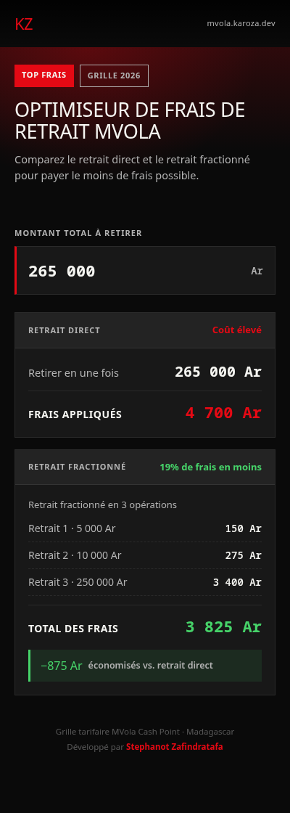
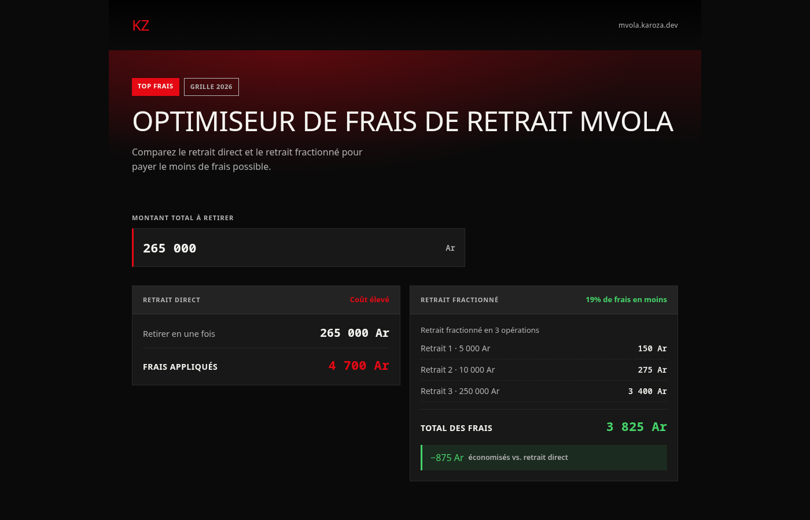

<div align="center">
  

  # KzMvola

  **Optimiseur de frais de retrait MVola**

  Calculez en temps réel la manière la plus économique de retirer de l'argent via MVola à Madagascar, en comparant le retrait direct et le retrait fractionné.

  [](./LICENSE)
  
  
  
  
</div>

---

## À propos

**KzMvola** est une web app PWA légère et rapide qui aide les utilisateurs de MVola (Cash Point) à Madagascar à réduire les frais payés lors de leurs retraits d'argent. Pour un montant donné, l'application compare :

- **Le retrait direct** : le montant retiré en une seule transaction, avec les frais correspondants.
- **Le retrait optimisé (fractionné)** : une décomposition du montant en plusieurs retraits, calculée pour minimiser la somme totale des frais selon la grille tarifaire officielle MVola.

L'économie réalisée entre les deux options est affichée instantanément à chaque saisie.

<div align="center">
  
  &nbsp;&nbsp;
  
</div>

## Fonctionnalités

- ⚡ Calcul instantané pendant la saisie, sans rechargement de page
- 🔢 Formatage automatique des milliers (`265 000 Ar`) avec un curseur qui reste à sa place
- 🧮 Algorithme d'optimisation exhaustif basé sur les sommets de paliers tarifaires (250 000 / 500 000 / 1 000 000 Ar)
- 🔗 Lien partageable : `?montant=265000` pré-remplit le montant à l'ouverture
- 📱 PWA installable, pensée pour une utilisation rapide sur mobile
- 🎨 Interface responsive au style « Netflix » (noir profond, rouge MVola, accents verts)
- ✅ Logique de calcul couverte par des tests ([Vitest](https://vitest.dev/))

## Grille tarifaire MVola (Cash Point)

| Tranche (Ar)            | Frais (Ar) |
| ------------------------ | ---------- |
| 100 – 1 000               | 100        |
| 1 001 – 5 000             | 150        |
| 5 001 – 10 000            | 275        |
| 10 001 – 20 000           | 550        |
| 20 001 – 25 000           | 650        |
| 25 001 – 50 000           | 1 300      |
| 50 001 – 100 000          | 1 900      |
| 100 001 – 250 000         | 3 400      |
| 250 001 – 500 000         | 4 700      |
| 500 001 – 1 000 000       | 8 800      |
| 1 000 001 – 2 000 000     | 14 700     |
| 2 000 001 – 3 000 000     | 19 600     |
| 3 000 001 – 4 000 000     | 24 500     |
| 4 000 001 – 5 000 000     | 29 400     |
| 5 000 001 – 6 000 000     | 34 300     |
| 6 000 001 – 7 000 000     | 39 200     |
| 7 000 001 – 8 000 000     | 44 100     |
| 8 000 001 – 9 000 000     | 49 000     |
| 9 000 001 – 10 000 000    | 53 900     |
| 10 000 001 – 11 000 000   | 59 000     |
| 11 000 001 – 12 000 000   | 64 000     |
| 12 000 001 – 13 000 000   | 69 000     |
| 13 000 001 – 14 000 000   | 74 000     |
| 14 000 001 – 15 000 000   | 79 000     |
| 15 000 001 – 16 000 000   | 84 000     |
| 16 000 001 – 17 000 000   | 89 000     |
| 17 000 001 – 18 000 000   | 94 000     |
| 18 000 001 – 19 000 000   | 98 000     |
| 19 000 001 – 20 000 000   | 100 000    |

## Stack technique

- [React 19](https://react.dev/) + [TypeScript](https://www.typescriptlang.org/)
- [Vite](https://vite.dev/) + [vite-plugin-pwa](https://vite-pwa-org.netlify.app/)
- [Tailwind CSS 4](https://tailwindcss.com/)
- [Vitest](https://vitest.dev/) + [Testing Library](https://testing-library.com/) pour les tests

## Démarrage

```bash
# Installer les dépendances
npm install

# Lancer le serveur de développement
npm run dev

# Lancer les tests
npm test              # une passe
npm run test:watch    # mode watch
npm run test:coverage # avec rapport de couverture

# Vérifier le style
npm run lint

# Construire pour la production
npm run build
```

## Tests

Les tests (`*.test.ts` / `*.test.tsx`, à côté du code qu'ils couvrent)
protègent contre les régressions sur :

- **la grille tarifaire et l'optimisation** (`src/utils/mvolaFeeCalculator.test.ts`) :
  frais par palier, cohérence des décompositions, garantie que le
  fractionnement ne coûte jamais plus cher que le retrait direct, respect
  du minimum de 100 Ar par retrait ;
- **le formatage des montants** (`src/utils/format.test.ts`) : séparateurs
  de milliers, analyse de saisie, repositionnement du curseur ;
- **le hook et l'interface** (`src/hooks/useMvolaCalculator.test.ts`,
  `src/App.test.tsx`) : calcul en temps réel, dépassement de plafond,
  initialisation depuis `?montant=`.

Ils sont également exécutés en CI (job `verify`) avant tout build ou
déploiement.

## Structure du projet

```
src/
├── types/mvola.ts               # Interfaces (paliers, résultats)
├── utils/
│   ├── mvolaFeeCalculator.ts    # Grille tarifaire + logique d'optimisation
│   └── format.ts                # Formatage des montants et gestion du curseur
├── hooks/useMvolaCalculator.ts  # État et calcul en temps réel
├── components/
│   ├── CalculatorForm.tsx
│   ├── DirectOptionCard.tsx
│   └── OptimizedOptionCard.tsx
├── test/setup.ts                # Configuration Vitest / Testing Library
├── *.test.ts(x)                 # Tests unitaires et d'intégration
└── App.tsx

docs/                            # Captures et gabarit de l'aperçu de partage
```

## Déploiement

Le projet est packagé en conteneur Docker (Vite build servi par Nginx) et
déployé automatiquement sur un VPS à chaque push sur `main` via GitHub
Actions (build → push vers `ghcr.io` → déploiement SSH). Voir
[DEPLOYMENT.md](./DEPLOYMENT.md) pour la configuration complète (secrets,
reverse proxy, TLS).

## Licence

Ce projet est **open source** et distribué sous licence [MIT](./LICENSE). Vous êtes libre de l'utiliser, le modifier et le redistribuer, y compris à des fins commerciales, à condition de conserver la mention de copyright.

## Auteur

Développé par **[Stephanot Zafindratafa](https://stephanot.karoza.dev)**.
