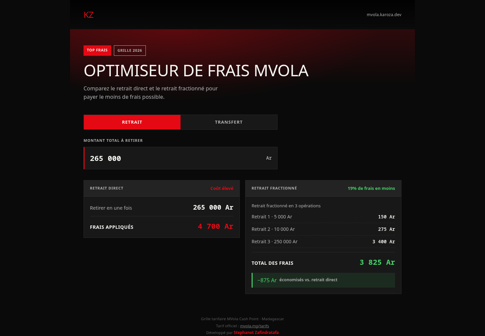
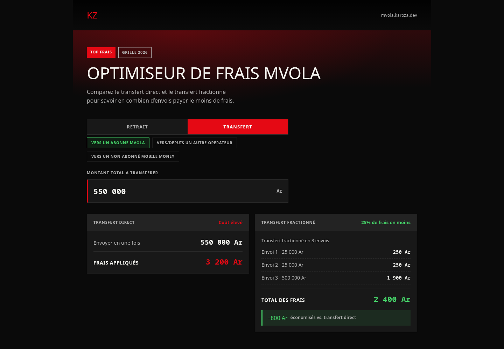
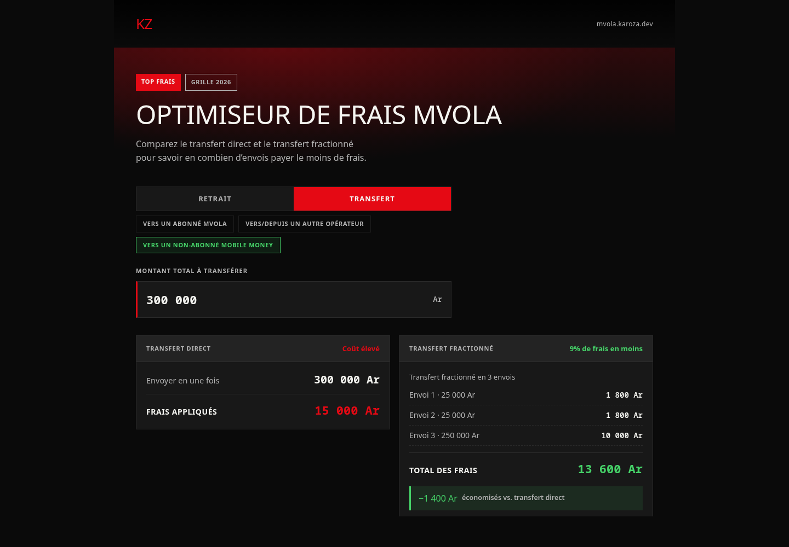

<div align="center">
  

  # KzMvola

  **Optimiseur de frais MVola**

  Calculez en temps réel la manière la plus économique de **retirer** ou de **transférer** de l'argent via MVola à Madagascar, en comparant l'opération directe et l'opération fractionnée.

  [](./LICENSE)
  
  
  
  
</div>

---

## À propos

**KzMvola** est une web app PWA légère et rapide qui aide les utilisateurs de MVola à Madagascar à réduire les frais payés sur leurs **retraits** (Cash Point) et leurs **transferts d'argent**. Pour un montant donné, l'application compare :

- **L'opération directe** : le montant retiré/transféré en une seule transaction, avec les frais correspondants.
- **L'opération optimisée (fractionnée)** : une décomposition du montant en plusieurs opérations, calculée pour minimiser la somme totale des frais — et donc le nombre de fois qu'il faut retirer ou transférer pour payer moins.

L'économie réalisée entre les deux options est affichée instantanément à chaque saisie.

> **Toutes les grilles tarifaires de l'application proviennent du tarif officiel MVola : <https://www.mvola.mg/tarifs/>.**

<div align="center">
  
  <br /><br />
  
  <br /><br />
  
</div>

## Fonctionnalités

- 🔀 Deux modes : **Retrait** (Cash Point) et **Transfert d'argent**, avec 3 destinations de transfert (abonné MVola, autre opérateur, non-abonné)
- ⚡ Calcul instantané pendant la saisie, sans rechargement de page
- 🔢 Formatage automatique des milliers (`265 000 Ar`) avec un curseur qui reste à sa place
- 🧮 Algorithme d'optimisation exhaustif (programmation dynamique) sur les sommets de paliers de la grille active
- 🔗 Lien partageable : `?mode=transfert&destination=non-abonne&montant=300000` pré-remplit tout à l'ouverture
- 📱 PWA installable, pensée pour une utilisation rapide sur mobile
- 🎨 Interface responsive au style « Netflix » (noir profond, rouge MVola, accents verts)
- ✅ Logique de calcul couverte par des tests ([Vitest](https://vitest.dev/))

## Grilles tarifaires

Barèmes repris **à l'identique du tarif officiel MVola** : <https://www.mvola.mg/tarifs/>
(section « Retrait Cash Point » et section « Transfert d'argent »).

### Retrait — Cash Point

| Tranche (Ar)            | Frais (Ar) |
| ------------------------ | ---------- |
| 100 – 1 000               | 100        |
| 1 001 – 5 000             | 150        |
| 5 001 – 10 000            | 275        |
| 10 001 – 20 000           | 550        |
| 20 001 – 25 000           | 650        |
| 25 001 – 50 000           | 1 300      |
| 50 001 – 100 000          | 1 900      |
| 100 001 – 250 000         | 3 400      |
| 250 001 – 500 000         | 4 700      |
| 500 001 – 1 000 000       | 8 800      |
| 1 000 001 – 2 000 000     | 14 700     |
| 2 000 001 – 3 000 000     | 19 600     |
| 3 000 001 – 4 000 000     | 24 500     |
| 4 000 001 – 5 000 000     | 29 400     |
| 5 000 001 – 6 000 000     | 34 300     |
| 6 000 001 – 7 000 000     | 39 200     |
| 7 000 001 – 8 000 000     | 44 100     |
| 8 000 001 – 9 000 000     | 49 000     |
| 9 000 001 – 10 000 000    | 53 900     |
| 10 000 001 – 11 000 000   | 59 000     |
| 11 000 001 – 12 000 000   | 64 000     |
| 12 000 001 – 13 000 000   | 69 000     |
| 13 000 001 – 14 000 000   | 74 000     |
| 14 000 001 – 15 000 000   | 79 000     |
| 15 000 001 – 16 000 000   | 84 000     |
| 16 000 001 – 17 000 000   | 89 000     |
| 17 000 001 – 18 000 000   | 94 000     |
| 18 000 001 – 19 000 000   | 98 000     |
| 19 000 001 – 20 000 000   | 100 000    |

### Transfert d'argent

Frais en Ariary. « – » = tranche non couverte par le barème officiel (les
transferts hors abonné MVola sont plafonnés à 5 000 000 Ar).

| Tranche (Ar)              | Vers un abonné MVola | Vers/depuis un autre opérateur | Vers un non-abonné |
| ------------------------- | -------------------- | ------------------------------ | ------------------ |
| 100 – 1 000               | 70                   | 200                            | 750                |
| 1 001 – 5 000             | 70                   | 250                            | 750                |
| 5 001 – 10 000            | 150                  | 500                            | 1 400              |
| 10 001 – 25 000           | 250                  | 1 000                          | 1 800              |
| 25 001 – 50 000           | 500                  | 1 500                          | 3 800              |
| 50 001 – 100 000          | 1 000                | 2 000                          | 4 800              |
| 100 001 – 250 000         | 1 900                | 3 500                          | 10 000             |
| 250 001 – 500 000         | 1 900                | 5 000                          | 15 000             |
| 500 001 – 1 000 000       | 3 200                | 8 500                          | 20 000             |
| 1 000 001 – 2 000 000     | 3 800                | 12 000                         | 30 000             |
| 2 000 001 – 3 000 000     | 5 000                | 14 500                         | 40 000             |
| 3 000 001 – 4 000 000     | 6 300                | 19 500                         | 50 000             |
| 4 000 001 – 5 000 000     | 7 500                | 24 000                         | 60 000             |
| 5 000 001 – 6 000 000     | 9 400                | –                              | –                  |
| 6 000 001 – 7 000 000     | 10 700               | –                              | –                  |
| 7 000 001 – 8 000 000     | 12 500               | –                              | –                  |
| 8 000 001 – 9 000 000     | 14 400               | –                              | –                  |
| 9 000 001 – 10 000 000    | 15 700               | –                              | –                  |
| 10 000 001 – 11 000 000   | 17 500               | –                              | –                  |
| 11 000 001 – 12 000 000   | 18 800               | –                              | –                  |
| 12 000 001 – 13 000 000   | 20 000               | –                              | –                  |
| 13 000 001 – 14 000 000   | 21 300               | –                              | –                  |
| 14 000 001 – 15 000 000   | 23 200               | –                              | –                  |
| 15 000 001 – 16 000 000   | 25 000               | –                              | –                  |
| 16 000 001 – 17 000 000   | 26 300               | –                              | –                  |
| 17 000 001 – 18 000 000   | 28 200               | –                              | –                  |
| 18 000 001 – 19 000 000   | 30 000               | –                              | –                  |
| 19 000 001 – 20 000 000   | 31 300               | –                              | –                  |

## Stack technique

- [React 19](https://react.dev/) + [TypeScript](https://www.typescriptlang.org/)
- [Vite](https://vite.dev/) + [vite-plugin-pwa](https://vite-pwa-org.netlify.app/)
- [Tailwind CSS 4](https://tailwindcss.com/)
- [Vitest](https://vitest.dev/) + [Testing Library](https://testing-library.com/) pour les tests

## Démarrage

```bash
# Installer les dépendances
npm install

# Lancer le serveur de développement
npm run dev

# Lancer les tests
npm test              # une passe
npm run test:watch    # mode watch
npm run test:coverage # avec rapport de couverture

# Vérifier le style
npm run lint

# Construire pour la production
npm run build
```

## Tests

Les tests (`*.test.ts` / `*.test.tsx`, à côté du code qu'ils couvrent)
protègent contre les régressions sur :

- **les grilles et l'optimisation** (`src/utils/mvolaFeeCalculator.test.ts`,
  `src/utils/feeGrids.test.ts`) : frais par palier sur chaque barème,
  continuité des paliers, cohérence des décompositions, garantie que le
  fractionnement ne coûte jamais plus cher que l'opération directe, respect
  du minimum de 100 Ar, résolution mode/destination → grille ;
- **le formatage des montants** (`src/utils/format.test.ts`) : séparateurs
  de milliers, analyse de saisie, repositionnement du curseur ;
- **le hook et l'interface** (`src/hooks/useMvolaCalculator.test.ts`,
  `src/App.test.tsx`) : calcul en temps réel, changement de mode et de
  destination, dépassement de plafond, initialisation depuis l'URL.

Ils sont également exécutés en CI (job `verify`) avant tout build ou
déploiement.

## Structure du projet

```
src/
├── types/mvola.ts               # Interfaces (grille, paliers, résultats)
├── utils/
│   ├── feeGrids.ts              # Les 4 barèmes officiels + formulations par mode
│   ├── mvolaFeeCalculator.ts    # Logique d'optimisation générique (paramétrée par grille)
│   └── format.ts                # Formatage des montants et gestion du curseur
├── hooks/useMvolaCalculator.ts  # État (mode / destination / montant) et calcul
├── components/
│   ├── ModeTabs.tsx             # Onglets Retrait / Transfert + choix de destination
│   ├── CalculatorForm.tsx
│   ├── DirectOptionCard.tsx
│   └── OptimizedOptionCard.tsx
├── test/setup.ts                # Configuration Vitest / Testing Library
├── *.test.ts(x)                 # Tests unitaires et d'intégration
└── App.tsx

docs/                            # Captures et gabarit de l'aperçu de partage
```

## Déploiement

Le projet est packagé en conteneur Docker (Vite build servi par Nginx) et
déployé automatiquement sur un VPS à chaque push sur `main` via GitHub
Actions (build → push vers `ghcr.io` → déploiement SSH). Voir
[DEPLOYMENT.md](./DEPLOYMENT.md) pour la configuration complète (secrets,
reverse proxy, TLS).

## Licence

Ce projet est **open source** et distribué sous licence [MIT](./LICENSE). Vous êtes libre de l'utiliser, le modifier et le redistribuer, y compris à des fins commerciales, à condition de conserver la mention de copyright.

## Auteur

Développé par **[Stephanot Zafindratafa](https://stephanot.karoza.dev)**.
